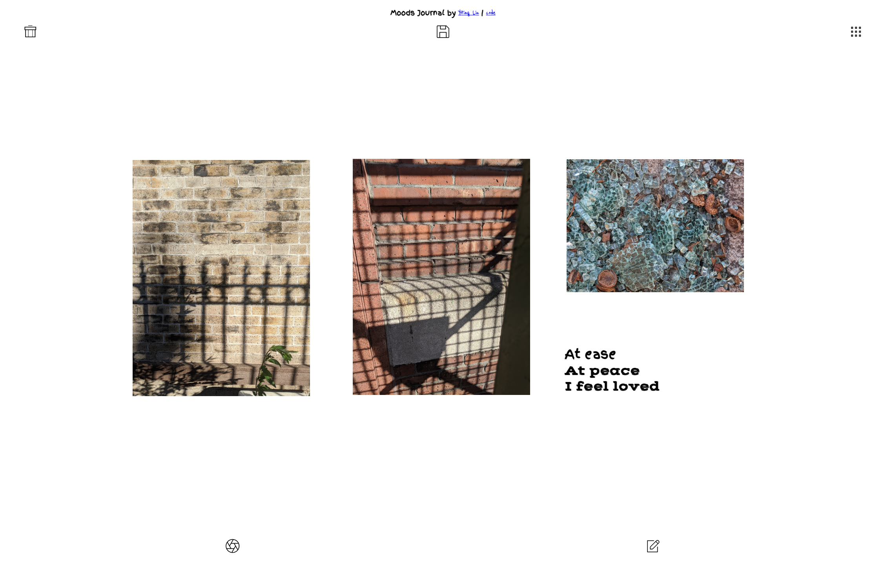

# Concept

A journal of my **material and color journey on emotions.** 

# Demo

[Moods Journal Demo Video](https://youtu.be/sKdJe8uR-dU)

<!--  -->
# [Play](https://moods101.netlify.app/)

# UI 
I created the [UI interaction](https://www.figma.com/proto/ak6rx7JdfrHBLeLCZsGZS6/Moods-Diary-App_Final?node-id=102%3A2523&scaling=min-zoom) on Figma. 


# Elements

This will be the study for materials and textures as a collection for my research on my phone. 

- Mood/Material Diary for myself to keep track of.
- If I can make it public then you would create your own login and store that on the database?
- Be able to share with friends or other platforms to store them
- A quick tool to store your thoughts and view them
    - [localStorage](https://developer.mozilla.org/en-US/docs/Web/API/Window/localStorage)
- one page per day
- camera input
- able to erase certain parts - mask the shape
    - [trace on top to keep the element](https://candle.itch.io/flatpack)
    - background removing API - paid
    - image cropping algorithm?
- swipe to set the date and time and create - inspo linked

[Card Diary - iOS App](https://www.behance.net/gallery/59120015/Card-Diary-iOS-App?isa0=1)

[https://www.pinterest.com/yliu557/thesis/material/](https://www.pinterest.com/yliu557/thesis/material/)


# Steps of creation recommended by Max

1. make things in ps - constrains of how you make the thing 
2. build the make and save part of the interface 
3. ability to view all and save 

# Scrapbook

Using direct image manipulation (panning, scaling & rotating), design a touch-based collage interface.

## **What is your app for?**

Collecting interesting materials related to moods for my thesis. My thesis is about translating feeling of being trapped and suffocation through objects or experiences. 

## **How do users add images/text?**

Users can upload their images or capture with their camera in the app and edit the texts

## **How do they remove them?**

I will create a trash icon where they can move the item and delete it

## **What are the constraints?**

They are limited to the canvas of their phone since they can not scroll in the canvas. 

# Progress

**Accomplishments by 11/15** 

1. Manipulating of size, scale, rotation
2. Uploading images from phone 
3. Changing fonts for texts 


**Process on 11/21/2020 + Problems**
1. Finally acheive to fixed the server and client side through npm installing express and npm install the rest of the packages 
2. Replaced the process.env.PORT with const port = process.env.PORT||3000; But still do not understand why that is undefined. 

3. Added in server.js. Otherwise, it keeps showing cannot GET
app.get('/', function(req, res){
  res.sendFile(__dirname+'/'); // change the path 
});


**Next Steps From 11/21, Done by 12/5** 

1. Allow user to draw on top 
2. Save to the canvas (done)
3. localStorage solution to check other saved creations in collections 
4. sharable with friends 
5. better UI (done)
6. potential for music in the bg 
7. Need to fix mobile touch problem for the collections. They can not touch to scroll. 

**Accomplishments by 12/5** 

1. Able to trash indivial element upon click 
2. Save the uploaded image to canvas through [html2canvas](http://html2canvas.hertzen.com/). It has to do with AllowTaint and useCORS. For more details, see [here](https://github.com/niklasvh/html2canvas/issues/722). 
3. Change the UI completely to make it minimalistic. Inspiration is originally from the template of [Sanity Sketching kit](https://www.figma.com/community/file/898186441853776318)
4. Merging dev to master. Follow this [tutorial](https://medium.com/@amitmutrezas/git-replace-the-master-branch-with-a-feature-branch-eb30e984bd5c). 
5. Problem of having the collections of posts showing up. Turns out I need to replace the script in package.json
```javascript
 "scripts": {
    "start": "node server.js"
  }
```


***Tutorials***
1. [Possible saving text to canvas](https://stackoverflow.com/questions/31570798/how-to-make-html-div-with-text-over-image-downloadable-savable-for-users)

2. [npm library to save html to canvas](http://html2canvas.hertzen.com/)
3. [For smoother touch](https://five.agency/cross-platform-javascript-touch-scrolling/)

****Tutorials for setting up server****
I have to set up a server since I hosted this on heroku before and I was told Heroku will occasionally delete stored files. 
1. [Setting up a virtual host on digital ocean.](https://itp.nyu.edu/networks/setting-up-a-virtual-host/)Use passwd rather than ssh for easier access.
2. Make sure the code works and then git clone your repo to your server
3. Make sure server port is 8080
4. GoDaddy setting up DNS to replace the virtual IP host name. Go to My Domains > Domain Settings > DNS. Under Records, add Type A following below.


# Research

I did research on ProjectLife and PicCollage. Some of the pros and cons I learned from playing with them are as below:

1. You can search image on the web and input it to the canvas
2. They have grid system where you can put images to the chosen grid 
3. Adaptable size for different social media platforms to share
4. Customizable in terms of color, patterns
5. Tutorial UI example from picCollage 

